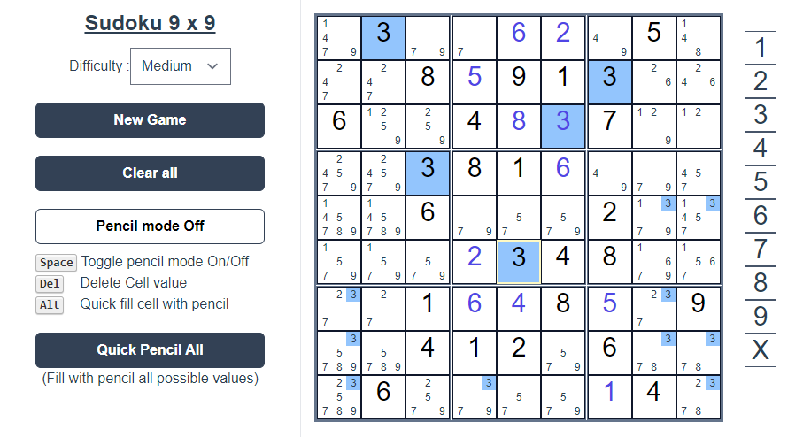

# Full-features Sudoku made with Vue 3 + Typescript + Tailwind css

A fun small project meant to practice Vue 3.  
You can find usage of :

- Vue 3 Composition and Options API Components
- [Tailwind](https://tailwindcss.com/) CSS.
- Use case for Vue3 slots and scoped slots.


## TODOs :
- [X] Prefill using saved sudoku puzzles.
- [X] Judge and mark cells on each assign.
- [X] Implement Pencil Mode.
- [X] Implement Smart Pencil Mode (checks when assigning and auto-remove).
- [ ] Add a Solver to quickly mark errors.
- [ ] Add game features (difficulty, time, score, ...).
- [ ] Add some styling that won't hurt your eyes.


## Running the project locally
```sh
git clone https://github.com/Oussama-Abderrahim/sudoku-vue.git
cd sudoku-vue
npm install
npm run dev
```
  App should be running on [localhost:3000](localhost:3000).

## Showing Off some VueJs beauty 
To be able to style the grid in a generic way, you will need to render by `n*n` blocks then inside each block render the `n*n` inside cells.  
Using scoped slots, you can transform (..hide) those 4 nested v-for loops into a single element ✨_✨:

```html
<sudoku-grid :grid="grid">
  <template v-slot.default="{ i, j, cell }">
    <sudoku-cell 
    :cell="cell" 
    :is-selected="(i == selected[0] && j == selected[1])" 
    @onCellSelect="selectCell(i, j)" />
  </template>
</sudoku-grid>
```


## Recommended IDE Setup

- [VSCode](https://code.visualstudio.com/) + [Volar](https://marketplace.visualstudio.com/items?itemName=johnsoncodehk.volar)
